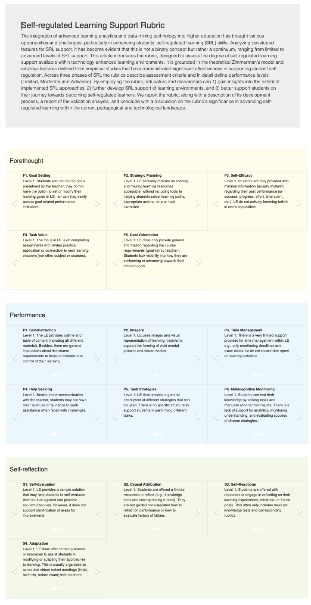

<br>
<div align="center">

<a href="https://catalparesearch.github.io/srl-support-rubric/"></a>

</div>

<br>
<h1 align="center">SRL Support Rubric</h1>

## The website and dataset of the *SRL Support Rubric* demonstrates the rubric, designed to assess the degree of self-regulated learning support available within technology enhanced learning environments. It is grounded in the theoretical Zimmerman's model and employs features distilled from empirical studies that have demonstrated significant effectiveness in supporting student self-regulation. 

The integration of advanced learning analytics and data-mining technology into higher education has brought various opportunities and challenges, particularly in enhancing students' self-regulated learning (SRL) skills. Analyzing developed features for SRL support, it has become evident that this is not a binary concept but rather a continuum, ranging from limited to advanced levels of SRL support. This article introduces the rubric, designed to assess the degree of self-regulated learning support available within technology enhanced learning environments. It is grounded in the theoretical Zimmerman's model and employs features distilled from empirical studies that have demonstrated significant effectiveness in supporting student self-regulation. Across three phases of SRL the rubrics describe assessment criteria and in detail define performance levels (Limited, Moderate and Advance). By employing the rubric, educators and researchers can 1) gain insights into the extent of implemented SRL approaches, 2) further develop SRL support of learning environments, and 3) better support students on their journey towards becoming self-regulated learners. We report the rubric, along with a description of its development process, a report of the validation analysis, and conclude with a discussion on the rubric's significance in advancing self-regulated learning within the current pedagogical and technological landscape. 

<!-- development-related badges -->
[](https://github.com/CATALPAresearch/srl-support-rubric/commit-activity)
[](https://github.com/CATALPAresearch/srl-support-rubric/commit/)
[](https://github.com/CATALPAresearch/srl-support-rubric/contributors/)
[](https://github.com/CATALPAresearch/srl-support-rubric/issues/)
[](https://opensource.org/license/mit)


<!-- Maturity-related badges 
see: https://github.com/mkenney/software-guides/blob/master/STABILITY-BADGES.md
-->
[](https://github.com/mkenney/software-guides/blob/master/STABILITY-BADGES.md#mature)


<!-- AI-related and LA-related badges -->
<!-- 
https://nutrition-facts.ai/

Privacy Ladder Level
Feature is Optional
Model type
Base model
Base Model Trained with Customer Data
Customer Data is Shared with Model Vendor
Training Data Anonymized
Data Deletion
Human in the Loop
Data Retention
Compliance


-->


<br><br>
<p align="center" hidden>
  
</p>

<p align="center">
  <a href="#key-features">Key Features</a> •
  <a href="#how-to-use">How To Use</a> •
  <a href="#download">Download</a> •
  <a href="#credits">Credits</a> •
  <a href="#related">Related</a> •
  <a href="#citation">Citation</a> •
  <a href="#license">License</a>
</p>


## Key Features

The main features *SRL Support Rubric* adds on top of *Page* are:


## Roadmap and Limitations
**Roadmap**
- layout, abstract, branding
- information about the rubric, 
- include the card deck
- wizzard for assessing learning environments, store data at google etc.

**Limitations**
- tba

## How To Use

To clone and run this application, you'll need [Git](https://git-scm.com) and [Node.js](https://nodejs.org/en/download/) (which comes with [npm](http://npmjs.com)) installed on your computer. From your command line:

```bash
# Open the website and brows the rubrics
https://catalparesearch.github.io/srl-support-rubric/

# or clone this repository and browse the raw rubric data using the file
src/rubric.json
```

## Download

You can [download](https://github.com/catalparesearch/srl-support-rubric/releases/tag/latest) the latest installable version of *SRL Support Rubric* for Moodle 3.11.

## Getting into Development
See our [getting started manual](readme_getting_started.md).


## Emailware

*SRL Support Rubric* is an [emailware](https://en.wiktionary.org/wiki/emailware). Meaning, if you liked using this plugin or it has helped you in any way, I'd like you send me an email at <niels.seidel@fernuni-hagen.de> about anything you'd want to say about this software. I'd really appreciate it!


## Citation

> Radovice, S., & Seidel, N. (2024). A Rubric for Support of Self-Regulated Learning. https://doi.org/10.17605/OSF.IO/WF5S3

````
@misc{Radovic2024-SoftwareSRLRubric,
author = {Radovice, Slavisa and Seidel, Niels},
doi = {10.17605/OSF.IO/WF5S3},
keywords = {P-APLE-II,open data},
title = {{A Rubric for Support of Self-Regulated Learning}},
url = {https://github.com/CATALPAresearch/srl-support-rubric},
year = {2024}
}
```

**Research articles and datasets about SRL Support Rubric:**
* Radović, S., & Seidel, N. (2024). Bridging learning science and learning analytics: Self-Regulation Learning support (SRL-S) rubric. International Conference on Learning Analytics & Knowledge (LAK24), in print.


## You may also like ...

* [format_serial3](https//github.com/catalparesearch/format_serial3) - Learning Analytics Dashboard for Moodle Courses

## License

[GNU GPL v3 or later](http://www.gnu.org/copyleft/gpl.html)


## Contributors
* Slavisa Radovic
* Niels Seidel [@nise81](https://twitter.com/nise81)

---
<a href="https://www.fernuni-hagen.de/english/research/clusters/catalpa/"></a>
<a href="https://www.fernuni-hagen.de/"></a>


